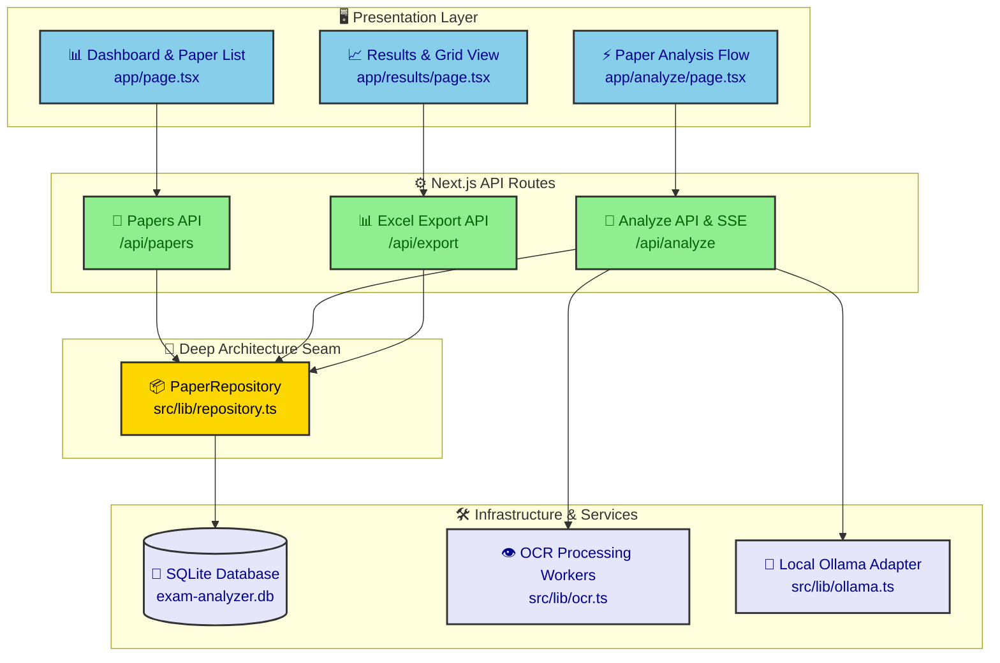
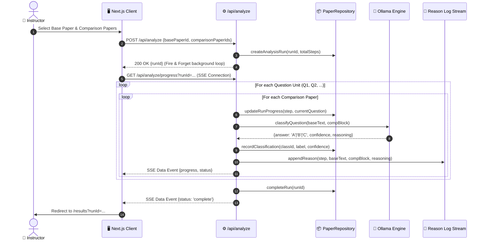
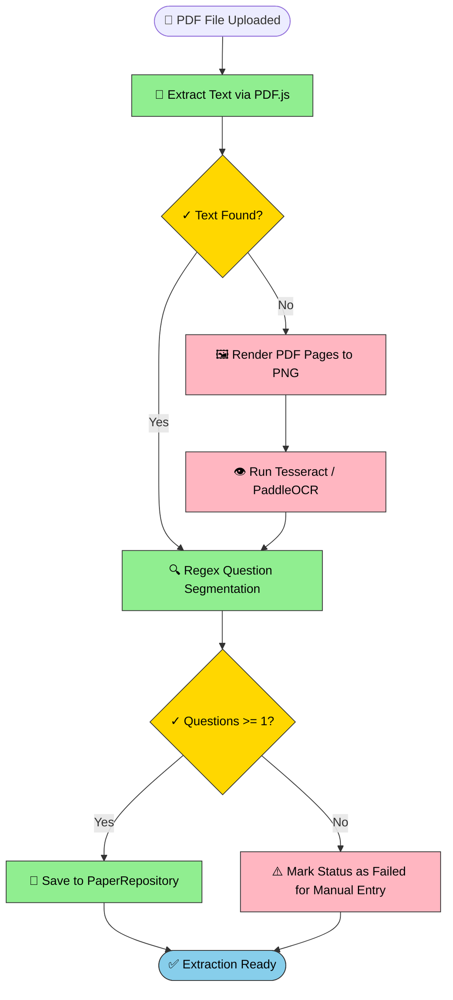
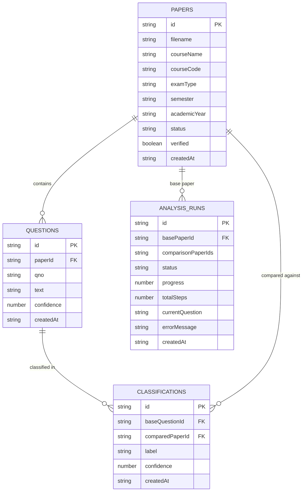

# Exam Analyzer

An intelligent, AI-powered exam paper analysis tool that extracts questions from PDF question papers, performs semantic similarity classification against historical exam corpora using local LLMs (Ollama / Gemma), and generates automated MSPA predictability reports in Excel format.

---

## Overview

**Exam Analyzer** automates the Multi-Subject Paper Analysis (MSPA) workflow for educational institutions. It analyzes question papers by comparing a target **Base Paper** against multiple **Historical Comparison Papers**, categorizing each base question into one of three predictability tiers:

- **Type A (High Predictability)**: Question appeared verbatim or near-verbatim in past papers.
- **Type B (Moderate Predictability)**: Question covers identical concepts with rephrased structure or altered values.
- **Type C (Unpredictable / Novel)**: Question covers novel topics not found in the comparison paper set.

> [!NOTE]
> The system operates 100% locally by default using Ollama and embedded OCR engines, ensuring zero data leakage and no external API key requirements.

---

## Architecture Overview

Exam Analyzer is built as a Next.js App Router application with a deep **PaperRepository** domain seam isolating SQLite persistence, an async background analysis engine, and real-time Server-Sent Events (SSE) progress streaming.



---

## Key Features

- **Multi-Stage PDF Question Extraction**: 4-level extraction pipeline utilizing `pdfjs-dist`, `pdf-lib`, `Tesseract.js`, and `PaddleOCR` with vision fallback for scanned papers.
- **Local Ollama LLM Classification**: Zero-latency classification using local Gemma models (`gemma4:e4b` / `gemma3:4b`) with automatic context window (`num_predict`) handling.
- **Audit Reasoning Logs**: Generates per-run step-by-step reasoning logs (`reason-{runId}.txt`) allowing instructors to inspect the LLM's classification logic.
- **Dynamic Excel Export (MSPA)**: Generates `.xlsx` reports with native Excel formulas (`=COUNTIF(...)`, `=SUM(...)`, `=AVERAGE(...)`) and standard percentage formatting (`0.0%`).
- **Real-Time Progress Streaming**: SSE endpoint (`/api/analyze/progress`) streams live question-by-question progress to the UI.
- **Neumorphic Design System**: Modern, accessible UI built with Tailwind CSS featuring soft dual-shadow styling.

---

## Data Flow & Workflows

### 1. Analysis Execution Sequence



### 2. PDF Question Extraction Pipeline Flow



---

## Database Schema & Architecture

The database layer is managed by SQLite via `better-sqlite3` with WAL mode enabled. All database access is encapsulated within the **`PaperRepository`** seam (`src/lib/repository.ts`).



---

## Prerequisites

### Required
- **Node.js 18+** — [Download](https://nodejs.org/)
- **Ollama** — [Download](https://ollama.ai/)
  - Pull your preferred model after installing:
    ```bash
    ollama pull gemma4:e4b
    # or
    ollama pull gemma3:4b
    ```

### Optional (Enhanced Extraction)
- **GraphicsMagick** — Improves PDF-to-image conversion speed and quality.
  - Linux: `sudo apt-get install graphicsmagick`
  - macOS: `brew install graphicsmagick`
  - Windows: `choco install graphicsmagick`

---

## Quickstart

1. **Clone repository & navigate to project directory**
   ```bash
   git clone https://github.com/KrishnaSingh1881/Anlysis.git
   cd Anlysis/exam-analyzer
   ```

2. **Install dependencies**
   ```bash
   npm install
   ```

3. **Configure Environment Variables**
   Create a `.env.local` file in `exam-analyzer/`:
   ```env
   OLLAMA_BASE_URL=http://localhost:11434
   DEFAULT_MODEL=gemma4:e4b
   OCR_CONFIDENCE_THRESHOLD=65
   DATABASE_PATH=./data/exam-analyzer.db
   ```

4. **Start Development Server**
   ```bash
   npm run dev
   ```
   Open [http://localhost:3000](http://localhost:3000) in your browser.

---

## Development & Verification

To verify TypeScript type safety and code quality:

```bash
# Run TypeScript compilation check
npx tsc --noEmit

# Run ESLint check
npm run lint
```

---

## Project Structure

```
exam-analyzer/
├── README.md                      # Main project documentation
├── .gitignore                     # Git ignore definitions
├── app/                           # Next.js App Router pages & API routes
│   ├── api/
│   │   ├── analyze/               # Analysis trigger & SSE progress stream
│   │   ├── export/                # MSPA Excel report generation
│   │   ├── papers/                # Paper upload & question management
│   │   └── settings/              # System configuration endpoints
│   ├── analyze/                   # Interactive analysis configuration UI
│   ├── results/                   # Classification grid & score report UI
│   └── page.tsx                   # Main Dashboard page
├── src/
│   ├── components/ui/             # Neumorphic UI design system components
│   ├── lib/
│   │   ├── repository.ts          # Deep PaperRepository domain seam
│   │   ├── db.ts                  # SQLite connection & schema migrations
│   │   ├── extraction.ts          # PDF text & OCR extraction engine
│   │   ├── ocr.ts                 # Tesseract & PaddleOCR worker pool
│   │   └── ollama.ts              # Ollama local LLM adapter
│   └── types/                     # Shared TypeScript interfaces
├── data/                          # SQLite database & PDF uploads (git-ignored)
├── package.json                   # Project dependencies & scripts
├── next.config.ts                 # Next.js framework configuration
└── tsconfig.json                  # TypeScript compiler settings
```
